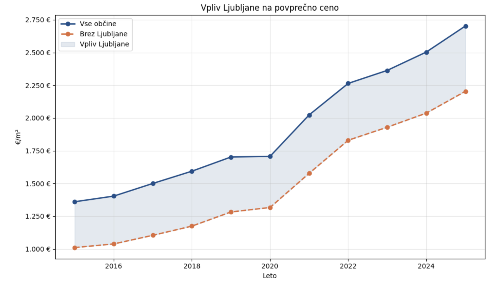
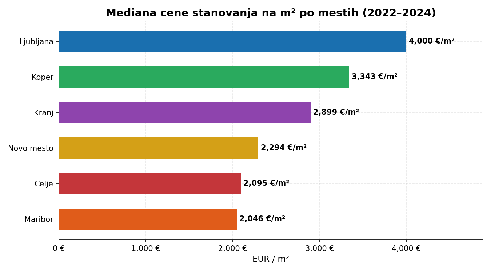

# Vmesno poročilo — Analiza slovenskega trga nepremičnin (2015–2025)

**Skupina:** 06  
**Predmet:** Podatkovno rudarjenje, 2025/26  
**Datum:** 15. 4. 2026

---

## Problem in podatki

Cilj projekta je razumeti dinamiko slovenskega trga nepremičnin v zadnjem desetletju z vidika cen, obsega transakcij in regionalnih razlik. Zanimalo nas je, kako so na trg vplivali makroekonomski šoki (epidemija COVID-19, inflacija, dvig obrestnih mer ECB) ter kateri dejavniki — lokacija, površina, prisotnost agencije — statistično zaznamujejo ceno.

**Vir podatkov:** Evidenca trga nepremičnin (ETN), Geodetska uprava RS (GURS), 2015–2025.  
Podatki so javno dostopni na [https://ipi.eprostor.gov.si/jgp/data](https://ipi.eprostor.gov.si/jgp/data).

**Obseg:** ~700.000 transakcij, 15+ atributov (datum, pogodbena cena, prodana površina, koordinate D48/GK, šifra občine, vloga agencije, vrsta nepremičnine, tržnost posla itd.).

**Vmesne raziskave/analiza podatkov (dostopno na GitHub) [https://github.com/karoliluka/PR2606](https://github.com/karoliluka/PR2606)** (`vmesna.ipynb`, `Gibanje_cen.ipynb`):
- Filtriranje na tržne posle (`TRZNOST_POSLA ∈ {1, 2}`) — kodi 1 in 2 sta enakovredni, ker je GURS v 2021–22 spremenil šifrant
- Izključeni posli s površino < 5 m² ali pogodbeno ceno ≤ 0
- Izračun atributa `cena_m2 = POGODBENA_CENA / PRODANA_POVRSINA`
- Odstranitev osamelcev z metodo IQR (1,5 × IQR) in absolutni prag 10.000 €/m²

---

## Izvedene analize in rezultati

### 1. Gibanje cen in obseg trga

Graf prikazuje letno mediano cene/m² skupaj s številom transakcij.
```
df_no_lj = df[df["OBCINA"] != "LJUBLJANA"]
trend_no_lj = df_no_lj.groupby("leto")["cena_m2"].median().reset_index()

plt.figure(figsize=(10, 6))
plt.plot(trend_slo["leto"], trend_slo["cena_m2"],
         marker="o", label="Vse občine", color="#1B4F8A", lw=2)
plt.plot(trend_no_lj["leto"], trend_no_lj["cena_m2"],
         marker="o", label="Brez Ljubljane", color="#E06C3A", lw=2, ls="--")

# osenčena razlika
skupaj = trend_slo.merge(trend_no_lj, on="leto", suffixes=("_vse", "_brezlj"))
plt.fill_between(skupaj["leto"], skupaj["cena_m2_brezlj"], skupaj["cena_m2_vse"],
                 alpha=0.12, color="#1B4F8A", label="Vpliv Ljubljane")

plt.legend()
plt.title("Vpliv Ljubljane na povprečno ceno")
plt.ylabel("€/m²")
plt.xlabel("Leto")
plt.gca().yaxis.set_major_formatter(mticker.FuncFormatter(lambda x, _: f"{int(x):,} €".replace(",", ".")))
plt.grid(alpha=0.3)
plt.tight_layout()
plt.show()
```



Cene so med 2015 in 2024 narastle za **~100–150 %**, pri čemer Ljubljana izstopa z rastjo **~170 %**. Obseg transakcij je dosegel vrh leta 2017 (8.058 poslov), nato pa padel na 5.666 v 2024 (–30 %). Opazujemo dve ključni diskontinuiteti:

- **2020:** COVID-19 je povzročil upad poslov za ~15 %, cene pa so ostale stabilne
- **2021–2022:** Postcovidni odboj skupaj z inflacijo je sprožil strm skok cen; hkraten dvig obrestnih mer ECB od 2022 naprej je zmanjšal dostopnost kreditov in zaustavil rast prometa

### 2. Regionalne razlike

Heatmap (`vmesna.ipynb`, celice 14–15) in primerjalni grafikon mest prikazujeta stalne razlike med občinami:

| Mesto | Mediana cene/m² (2022–24) |
|-------|---------------------------|
| Ljubljana | 4.000 € |
| Koper | 3.343 € |
| Kranj | 2.899 € |
| Novo Mesto | 2.294 € |
| Celje | 2.095 € |
| Maribor | 2.046 € |

```
pivot = trend_obcine[trend_obcine["OBCINA"].isin(obcine)].pivot(
    index="OBCINA", columns="leto", values="cena_m2"
)
pivot.index = [o.title() for o in pivot.index]

fig, ax = plt.subplots(figsize=(13, 5))

sns.heatmap(
    pivot, cmap="YlOrRd", ax=ax,
    annot=True, fmt=".0f",       # vrednosti v celicah
    linewidths=0.4, linecolor="white",
    cbar_kws={"label": "Mediana €/m²", "shrink": 0.8}
)

ax.set_title("Mediana cene (€/m²) po občinah in letu", pad=12)
ax.set_xlabel("Leto")
ax.set_ylabel("")
plt.tight_layout()
plt.show()
```

**Ljubljana** je daleč najdražja — posledica koncentracije delovnih mest in migracije. **Koper** je presenetljivo drag, kar razlagamo z bližino Italije, turizmom in prometno-logistično vrednostjo primorske regije. **Nova Gorica** kaže najnižjo procentualno rast (~80 %), verjetno zaradi manjšega lokalnega trga in geografske oddaljenosti od glavnih zaposlitvenih centrov.



### 3. Vpliv nepremičninske agencije

Analiza (`vmesna.ipynb`, celica analiza_7) primerja mediano cen poslov z in brez posredništva:

- **Brez agencije:** 1.610 €/m² (n = 24.249)
- **Z agencijo:** 1.846 €/m² (n = 9.227)
- **Razlika:** +14,7 %

Razlika je prisotna v vseh mestih, a ni enakomerna: v Kopru je premija večja kot v Mariboru, kar nakazuje, da trg sam po sebi vpliva na vrednost posredništva.

---

## Odprta vprašanja

- **Selektivna pristranskost:** Ali agencije prevzemajo dražje nepremičnine, ali resnično dodajajo vrednost? Za odgovor bi bila potrebna analiza, ki nadzoruje površino, lokacijo in starost nepremičnine (npr. regresija).
- **Napovedno modeliranje:** Zgraditi regresijski model za oceno cene na podlagi lokacije (koordinat), površine, leta prodaje in tipa nepremičnine.
- **Analiza po tipu:** Trenutna analiza združuje stanovanja, hiše in poslovne prostore — segmentacija po tipu bi razkrila dodaten vzorec.

---